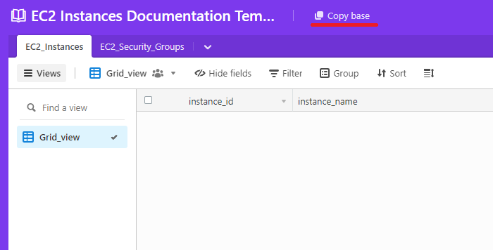
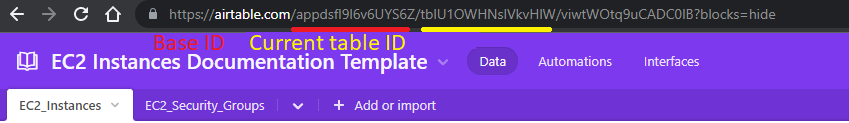

########################
EC2 INSTANCES DESCRIPTOR
########################
    
^^^^^^^^^^^^^^^^^^
Installation/Usage
^^^^^^^^^^^^^^^^^^

| **Project Public Repository :**  `GitHub Repository`_.
| **Detailed documentation :** `EC2 Descriptor`_.
|
EC2 instances descriptor is a script that wraps boto (Amazon Official SDK for python) to make it easier to use on traceability processes as well as to enforce “resources state changed” policies (creations, terminations, modifications). Also, a set of classes and methods is provided to interact with Airtable API (REST) without using an SDK.

It’s written and has been tested on Python 3.9.13. To avoid environment incompatibilities a venv is provided using Poetry.

The Script can be deployed locally and toward an AWS lambda function execution environment, according to 
the specification of SAM \(Serverless Application Model\).

Clone Project Repository
************************

| Use git clone:

.. code-block:: console

    git clone https://github.com/jesse0099/EC2_INSTANCE_DESCRIPTOR

or your favorite method
for this task. 

Create envs.py file
*******************

Inside app directory::

    Repository-Location/
       └──EC2_INSTANCE_DESCRIPTOR/
           └──app/
              └── envs.py.example
              
You'll find the file `envs.py.example`, make a copy of it named `envs.py` and place it in the same location 
that `envs.py.example`

| Command line one-liner options:
|
|  **Powershell**

.. code-block:: console

    Copy-Item .\envs.py.example .\envs.py
    
| **Linux distros with cp available**
.. code-block:: console 
    
    cp .\envs.py.example .\envs.py

Clone Airtable Template
***********************

First, you need an Airtable account. Once you created one, continue.

**Template:** `Airtable Template`_.

Open the template provided above and click on "copy base"

    
Replace envs.py file values with yours
**************************************

API key 
^^^^^^^

**You can get your api key visiting the account section of your airtable profile:** `Airtable API Key`_.

Tables IDs and Base ID
^^^^^^^^^^

Once you cloned the base, you can access it from the workspaces panel, located in the account section 
where the API key can also be found. Open your base, and check the URL. You can get the **Base ID**
and the **Tables IDs** from it. Select the different tables to get the corresponding table ID.

Open the virtual environment shell
**********************************

Inside the repository root directory::

    Repository-Location/
       └──EC2_INSTANCE_DESCRIPTOR/

.. code-block:: console

    poetry shell

Install dependencies
********************

*Check if you're inside the venv: Execute pwd command and verify that ec2-instance-descriptor-py3.9 name is present*

Inside the venv shell (ec2-instance-descriptor-py3.9):

.. code-block:: console

    poetry install; poetry install -E all_extras

Execute locally
***************

Inside the venv shell (ec2-instance-descriptor-py3.9), under app directory::

    Repository-Location/
       └──EC2_INSTANCE_DESCRIPTOR/
           └──app/

.. code-block:: console
    
    python ./ec2_instances_descriptor.py 

Execute with docker
*******************

Requisites:
- aws cli configured locally, associated with a key with the necessary permissions

How to run:
- create a file with necessaries variables in app folder called docker-env. if DEV_MODE is True you need to define AIRTABLE_API_KEY, AIRTABLE_BASE_ID, EC2_INSTANCES_TID and EC2_SECURITY_GROUPS_TID in env.py and set in docker-env just DEV_MODE and AWS_PROFILE (the profile should exists on your local), when DEV_MODE is False you need to set the all the variables mentioned in docker-env

.. code-block:: console

    AIRTABLE_API_KEY=keyxxxx
    AIRTABLE_BASE_ID=appxxxx
    EC2_INSTANCES_TID=tblbxxxx
    EC2_SECURITY_GROUPS_TID=tblnxxxx
    DEV_MODE=True
    AWS_PROFILE=buyside

- build the image 

.. code-block:: console

    docker image build -t ec2-doc .

- run

.. code-block:: console

    docker run -v ~/.aws/:/root/.aws:ro --env-file ./app/docker-env ec2-doc

How to deploy in kubernetes:
****************************
- Define vars in deployment/ec2-doc/values.yaml in secrets section
- inside deployment/ec2-doc/ run:

.. code-block:: console
    
    helm install ec2-doc . --values values.yaml

.. _Airtable Template: https://airtable.com/shr6WQNfVLNhVMbQv
.. _Airtable API key: https://airtable.com/account
.. _Docker Install: https://docs.docker.com/get-docker/
.. _Poetry Docs and Install: https://python-poetry.org/docs/
.. _Python Docs and Install \(3.9\): https://www.python.org/downloads/
.. _GitHub Repository: https://github.com/jesse0099/EC2_INSTANCE_DESCRIPTOR
.. _poetry shell: https://python-poetry.org/docs/cli/#:~:text=has%20no%20option.-,shell,-The%20shell%20command
.. _EC2 Descriptor: https://ec2-instance-descriptor.readthedocs.io/en/latest/
